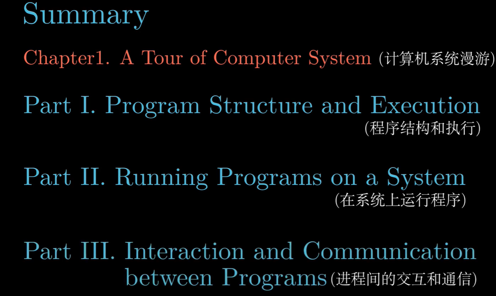
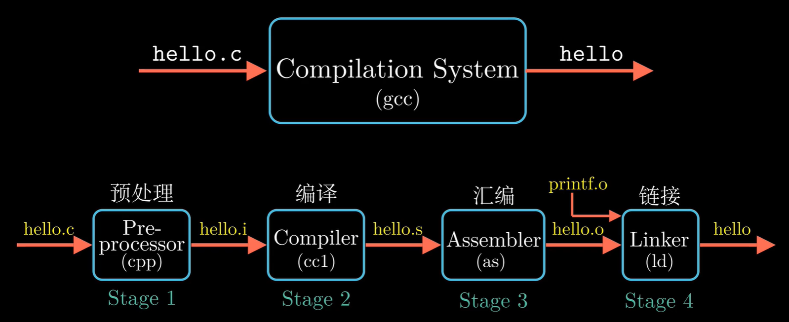
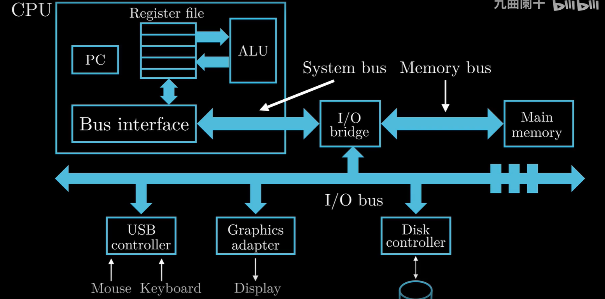
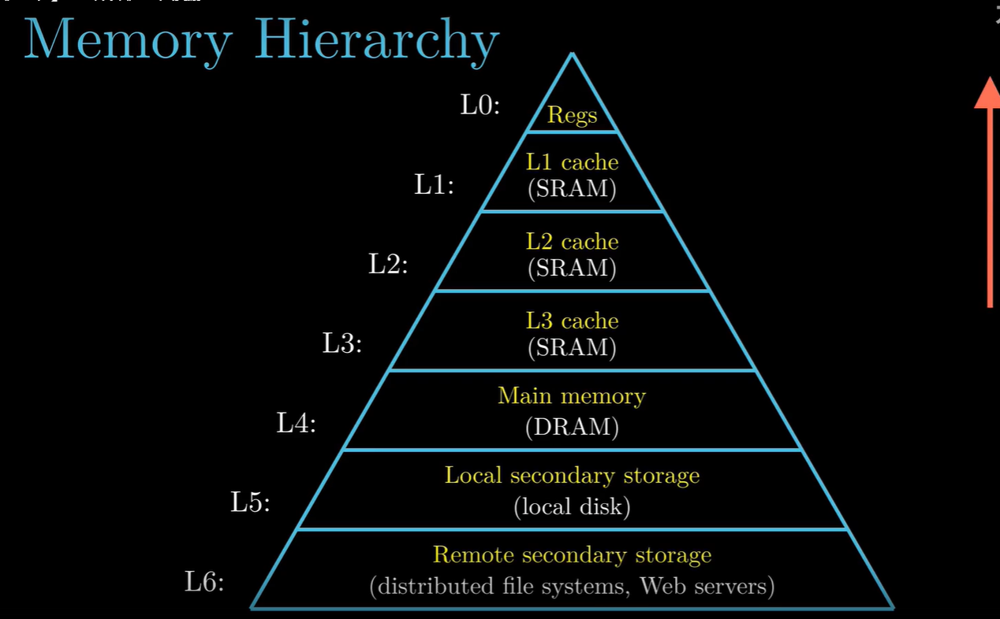
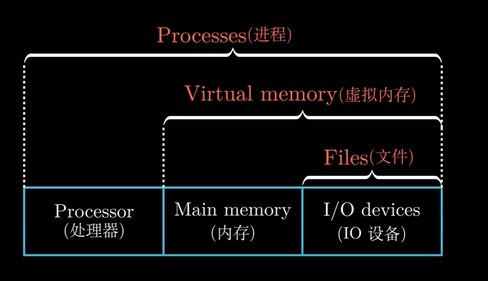
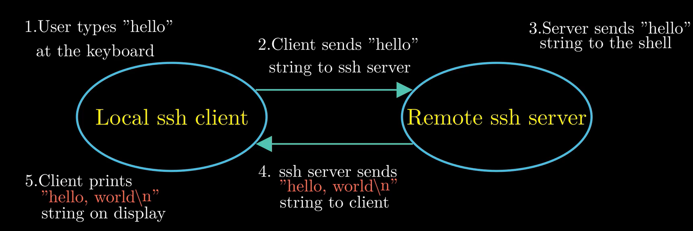
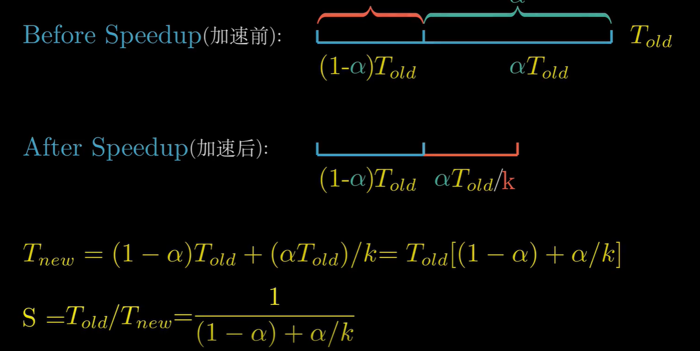
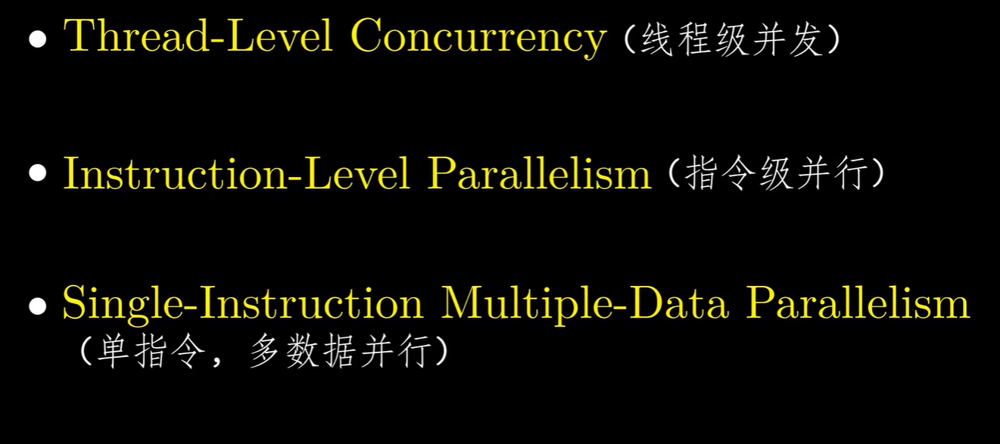

# 第一章 计算机系统漫游

整本书的内容分为以下三个部分。

##### hello.c的程序完整的编译过程

##### 计算机的组成

##### 存储器与寄存器

上层是下层的高速缓存。上面的越贵，存储量越小，速度越快。下面的越便宜，存储量越大，速度越慢。

##### 抽象概念

文件是对IO设备的抽象。

虚拟内存是内存，IO设备的抽象。

进程是处理器，内存，IO设备的抽象。

##### SSH进行C程序传递

SSH进行C语言传递的模型图。

##### 阿姆达尔定律

进行加速的定律

优化大部分组件才能得到性能很好的加速。

