第七章 链接

## 编译器驱动程序

链接是将各种代码和数据片段收集并组合成为一个单一文件的过程，这个文件可被加载（复制）到内存并执行。

对于小型程序链接是自动进行的。

以下是学习链接的作用

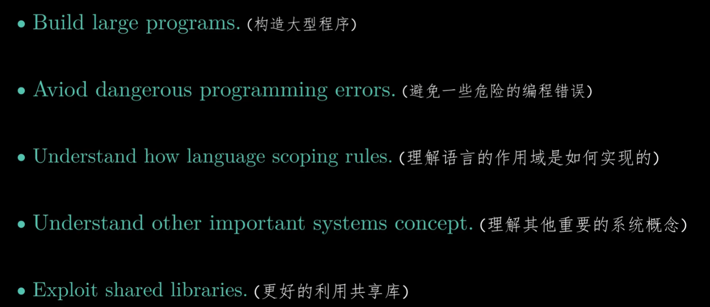

链接在编译的最后一步，就是将汇编所生成文件打包成一个可执行文件.prog。

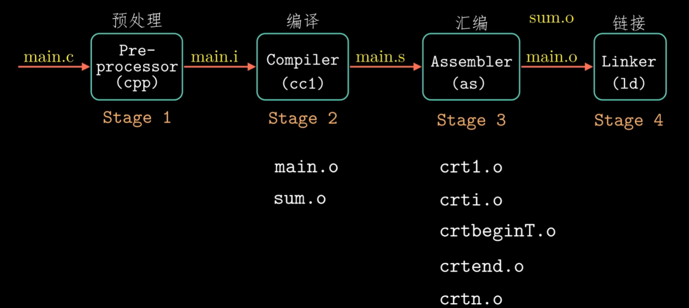

## 

## 可重定位目标文件

使用命令

```shell
linux> gcc -c main.c
//-c 只使用编译和汇编操作，不进行链接。由此可以得到main.o
```

每个main.o中所带有的文件结构

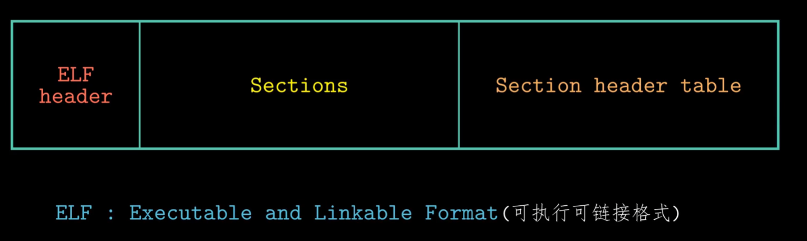

输入readelf -h main.o 命令得到ELF头文件

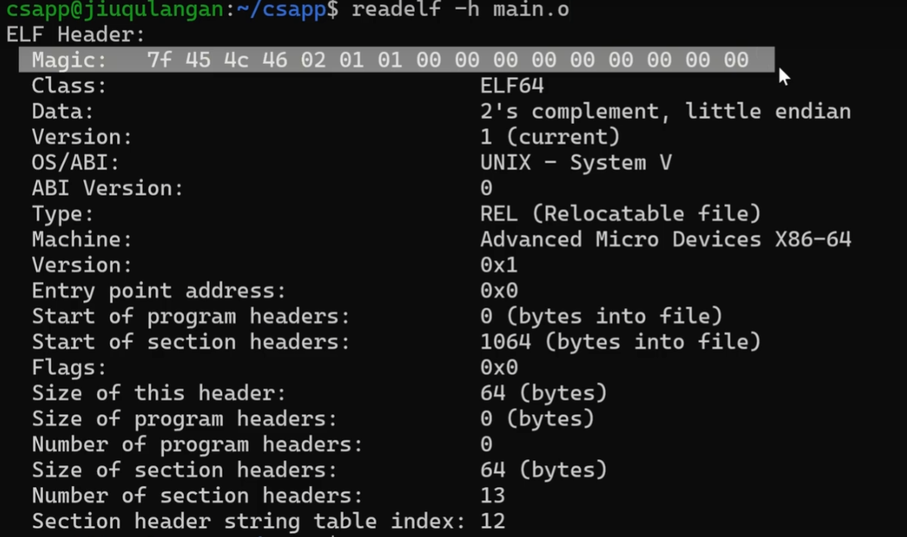

### section部分

.text:已编译程序的机器代码

.rodata:只读数据

.data:已初始化的全局和静态C变量

.bss:未初始化的全局和静态C变量，以及所有被初始化为0的全局或静态变量。

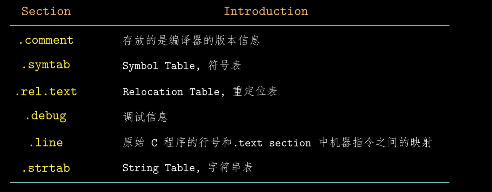


## 符号和符号表

COMMON:和.bss类似，其存储未初始化的全局变量。

使用名称修饰，防止静态变量出现冲突。

对每一个可重定位目标模块m豆友一个符号表，它包含m定义和引用的符号信息。有三种不同的符号

1.由模块定义并且能被其他模块阴影的全局符号。全局连接器符号对应于非静态的C函数和全局变量。

2.由其他模块定义并被该模块引用全局符号。这被称作外部符号。对应于在其他模块中定义的非静态C函数和全局变量。

3.只被该模块定义和引用的局部符号。它们对应于带static属性的C函数和全局变量。这些符号在模块m中任何位置都可见，但是不能被其他模块引用。

**尽量使用static保护你的变量和函数是很好的习惯。**


## 符号解析和静态库

链接器解析符号的引用方法是将每个引用于它输入的可重定位木匾文件的符号表中的一个确定的符号定义关联起来。

**强符号**：已初始化的全局变量与函数

**弱符号**：未初始化的全局变量

### Linux链接器使用以下规则处理多重定义的符号名

1.不允许有多个同名的强符号

2.如果有一个强符号和多个弱符号同名，那么选择强符号

3.如果有多哥弱符号同名，那么从这些弱符号中任意选择一个

构造静态库文件使用命令

```
ar rcs libvector.a addvec.o mulvec.o
```

我们就生成了静态库文件libvector.a

静态库与程序链接过程。


 

## 静态库解析过程

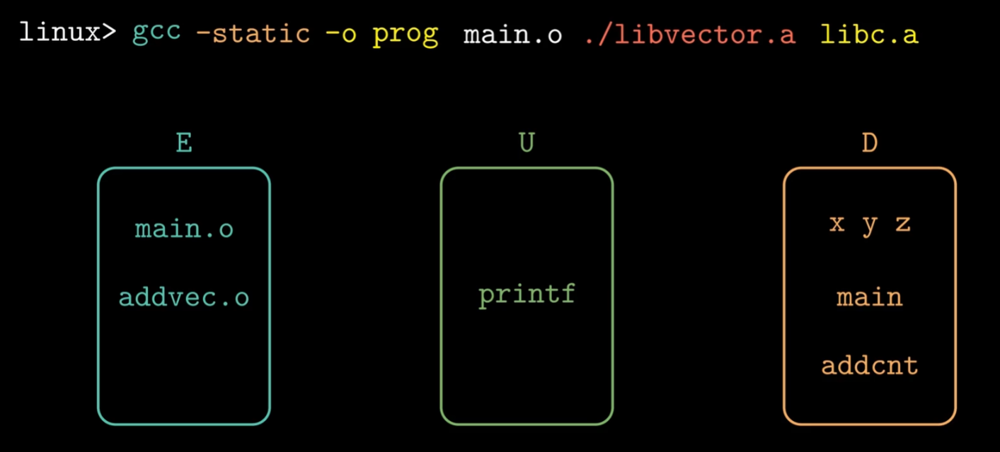

对于静态库文件所有成员目标文件都要依次进行上述处理，直到集合U和集合D不再变化。

此时不在集合E中的都会被丢弃。

静态库的先后解析顺序是有要求的

如case1，其libx.a 和libz.a一定要在liby.a的前面

当如case2互相调用时，libx.a出现了两次。case2其实也可以将两个静态库合并来解决。

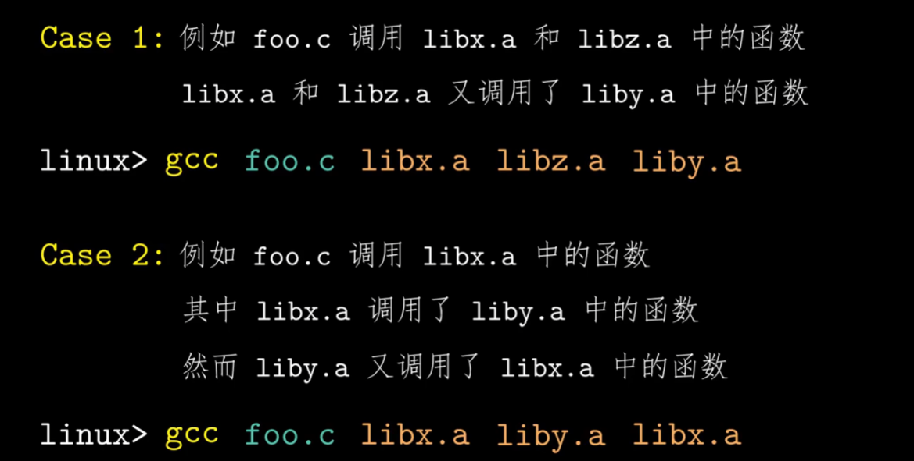


## 重定位

当链接器把代码中的符号引用和对应符号的定义关联起来后，链接器可以确定将哪些目标文件进行合并。

**重定位**：在这个过程中链接器合并输入模块，并为每个符号分配运行时的地址。

1. 重定位节和符号定义
2. 重定位节的符号引用

合成之前main.o和sum.o的text section都是从0开始的。原书中假设合成后的text section从0x4004d0开始。原因是在64位Linux中ELF可执行文件从0x400000处开始分配。而前面还有ELF head一起其他信息所以假设从此开始。

这一步完成后，程序的每一条指令和全局变量都有了唯一运行的内存地址。

**第二步**重定位section的符号引用。

当汇编器生成一个目标模块时，他并不知道数据和代码最终会放在内存的什么位置，他也不知道这个模块引用的任何外部定义的函数或者全局变量的位置哦。所以无论何时汇编器遇到对最终位置未知的目标引用，他就会生成一个重定位条目

代码的重定位条目放在.rel.text中，已初始化数据的重定位条目放在.rel.data中。

重定位地址类型有很多，我们只需要关注**相对地址的重定位和绝对地址的重定位**。

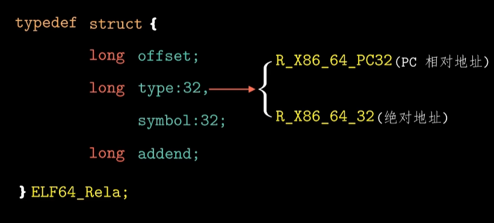

### 重定位PC的相对引用

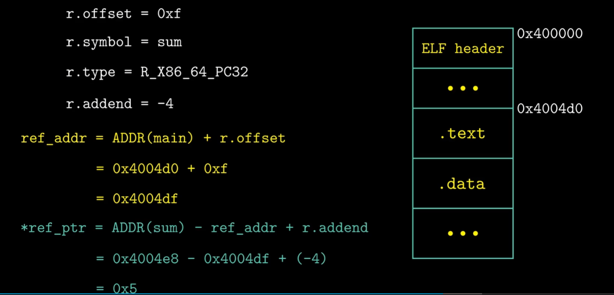

执行call指令时CPU所运行的：

​	1.将PC压入栈中

​	2.修改的PC的值，PC的值加偏移量PC<-PC+0X5=0X4004e3+0x5=0x4004e8

### 重回定位绝对引用

其相对简单

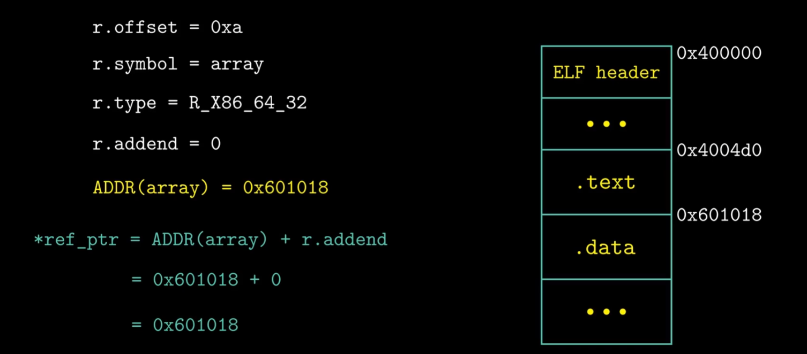

重定位就是直接加上偏移量*ref_ptr。如图经过重定位之后会变成这样。由于x86是小端法储存，所以为逆序。

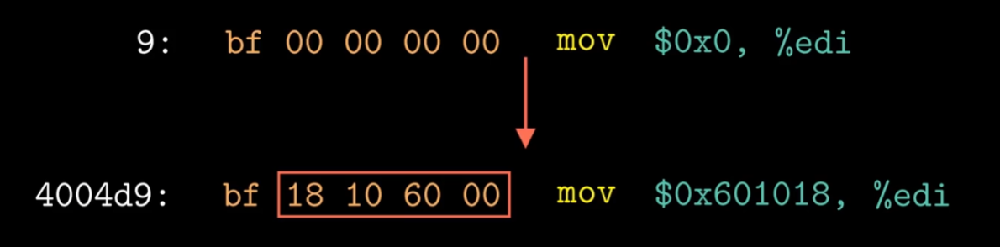

**经过重定位之后我们就确定目标文件text section和data section的内容。当程序执行加载时，加载器会把section这些字节直接复制到内存里，不用执行任何修改就能使用。**


## 可执行文件

可执行程序的结构

代码段和数据段会直接放在内存里执行。

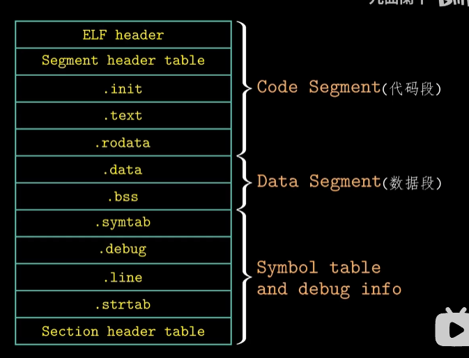

代码段和数据段的信息

off是可执行文件的开始处，vaddr和paddr表示这个段开始于内存地址什么位置。filesz表示在目标文件中占用大小，memsz表示在内存占用大小。

数据段加载到内存多了8个字节。这8个字节是.bss的数据。

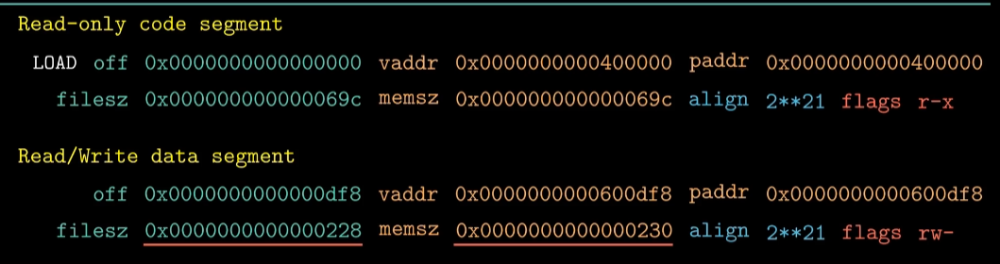

在链接器中起始地址vaddr有以下要求。这种要求是对程序的优化，提高程序的速度。

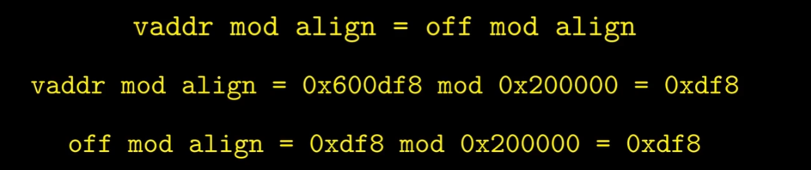

当加载器运行时，会创建类似以下的内存映像

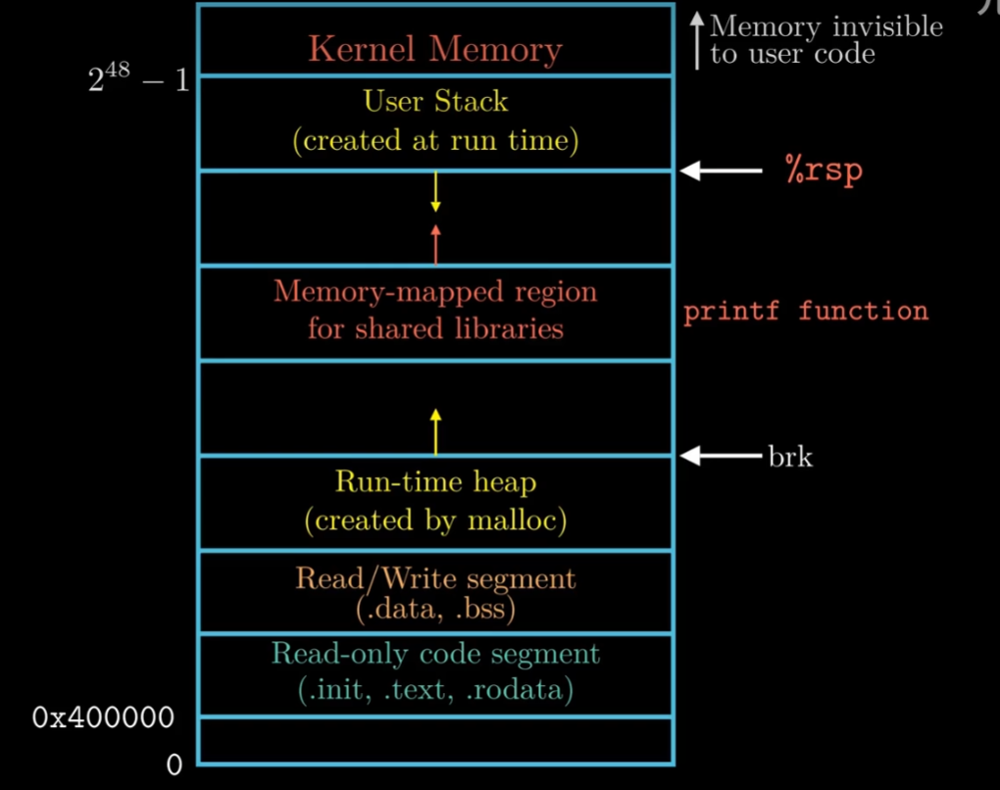

在程序头部表引导下，加载器将可执行文件的片复制到代码段和数据段。接下来加载器跳转到程序的入口点，也就是_ start函数的地址。这个函数是在系统目标文件ctrl.o中定义的，对所有的C程序都一样。_ start函数调用系统启动函数__libc_start_main，该函数定义在libc.so中。它初始化执行环境，调用用户层的main函数，处理main函数的返回值，并且在需要的时候把控制返回给内核。


## 动态链接共享库

### 一些缺点：

1.静态库需要定期维护

2.几乎每个C程序都要使用标准的I/O函数。

### 共享库：在linux中一般是.so，windows中一般是使用.dll。

共享库libvector.so的代码和数据并没有被复制到prog2中，只复制了一些符号表和重定位信息。

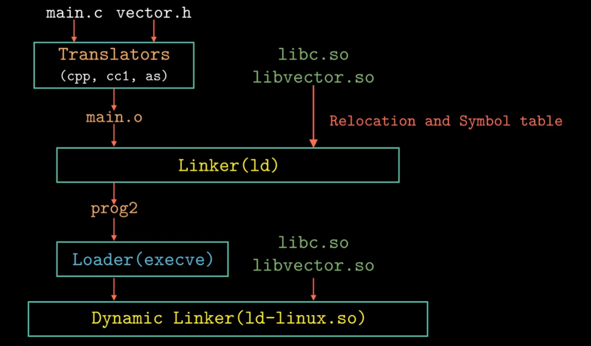

首先将lib.so的代码重定位到某个数据段，然后重定位libvector.so中的代码和数据到另一个数据段，再重定位prog2中由lib.so和libvector.so定义的符号引用。

然后动态链接器将控制权交给应用程序prog2，此时共享库的位置就不会变了。接下来prog2执行。

### 动态链接库作用：

1.分发软件

2.构建高性能的web服务器

### 运行时加载和链接共享库

dlopen：动态加载共享库

dlsym：调用函数addvec实现我们需要的功能

dlclose：卸载共享库

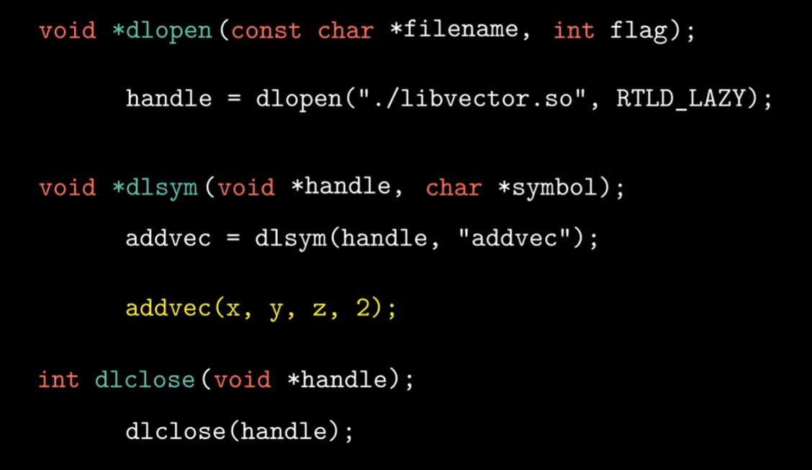


