# 第三章 程序的机器级表示

**C代码会首先生成汇编代码，再化为机器代码**

机器代码，汇编代码，C代码某种意义上也是一一对应的。

## 寄存器与数据传送指令

**寄存器**

8086中有8个寄存器。后来的处理器拓展到16个64位寄存器。

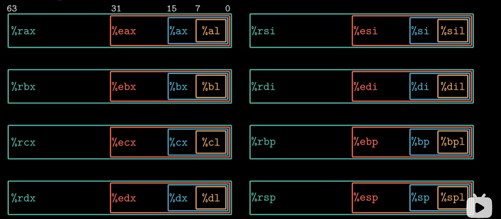

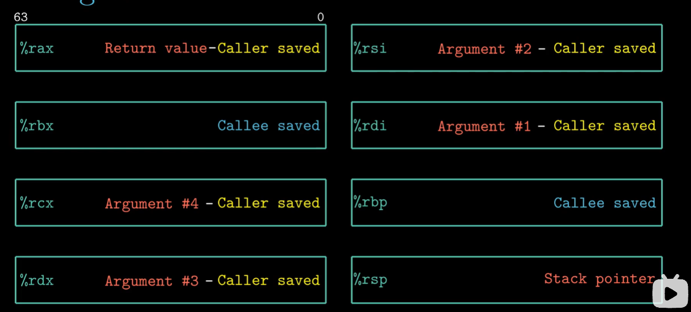

**机器指令**

如下图指令分为操作码和操作数

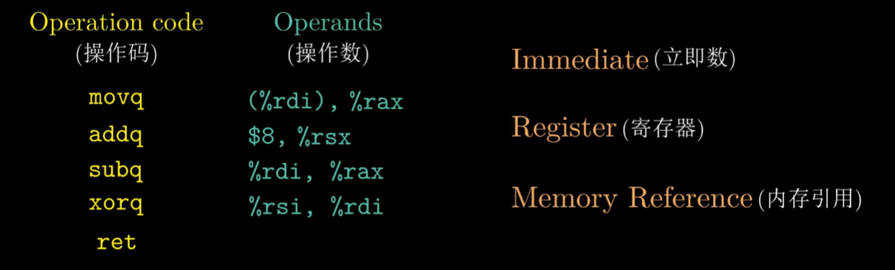

**内存引用的多种形式**

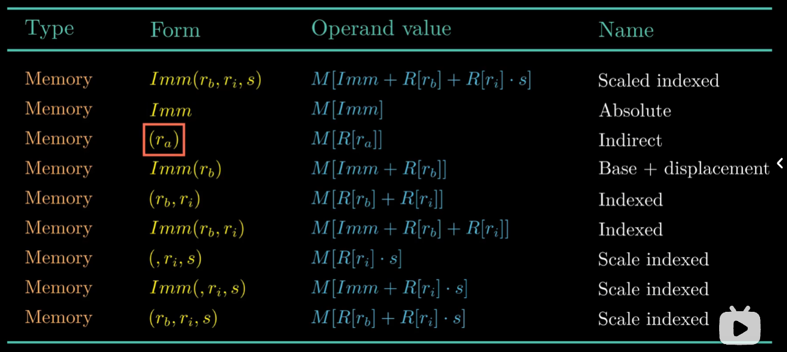

**mov指令**

mov指令的后缀要与寄存器大小得是匹配的

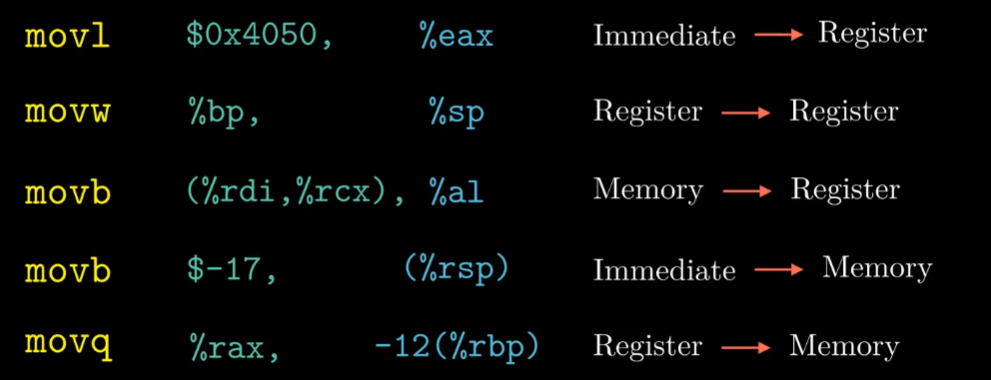

## 栈与数据传送指令

同一寄存器不同数位表示

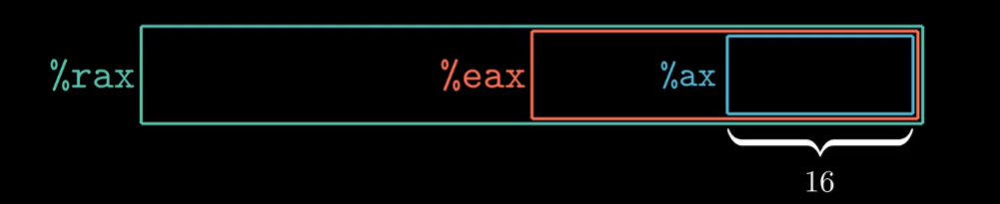

C语言的指针本质上就是地址。

push指令的本质就是将数据写入到内存里。

pop指令是读取数据并改变栈顶指针。

## 算术与逻辑操作的指令

**一元操作**

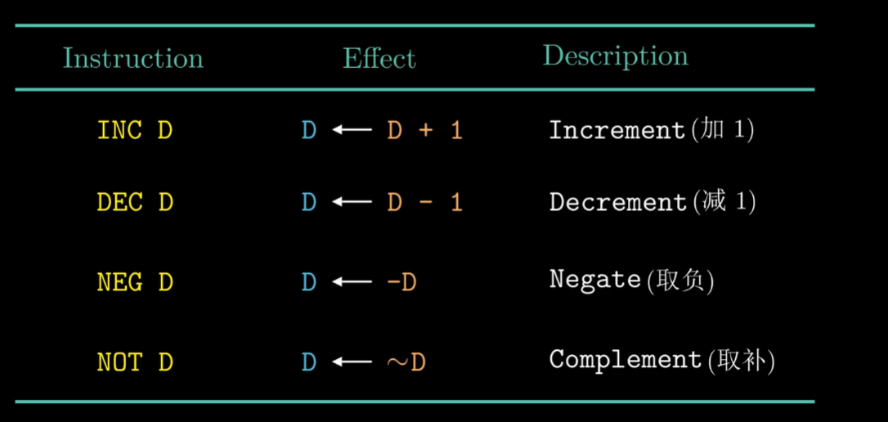

**二元操作**

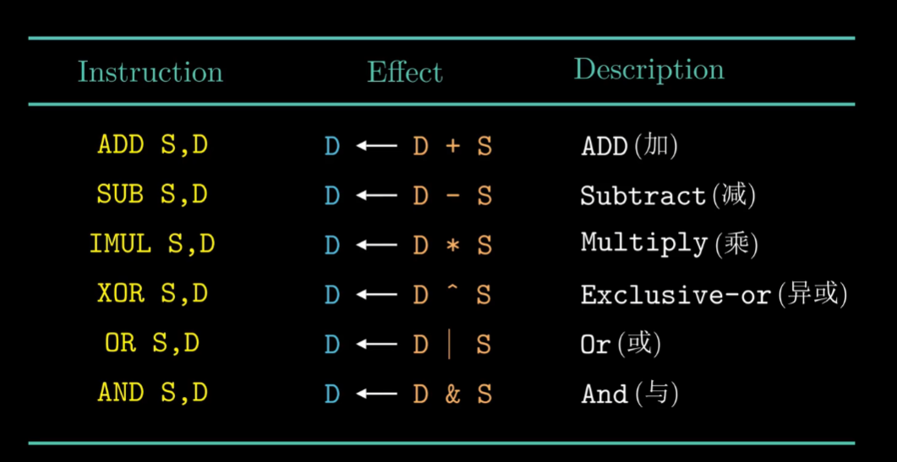

**移位操作**

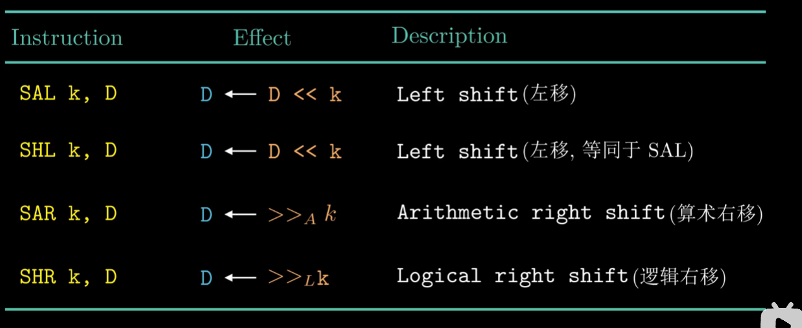

编译器在形成汇编代码时，自动使用更高效的语句。

## 指令与条件码

**ALU：算术逻辑单元**

**条件码寄存器**

CF-进位标志：检测无符号数的溢出

ZF-零标志：当最近操作为0时，零标志会置1。

SF-符号标志：当最近操作结果小于0时，符号标志会置1。

OF-溢出标志：针对有符号数，当正溢出或负溢出时，会置1.

cmp指令：与sub指令类似，两个操作数的差设置条件码寄存器，但并不会更新寄存器的值。

test指令：与and指令类似，两个操作数的和设置条件码寄存器，但并不会更新寄存器的值。

当取小于时，通过符号标志SF和溢出标志OF的异或结果得出$a<b$还是$a>b$。

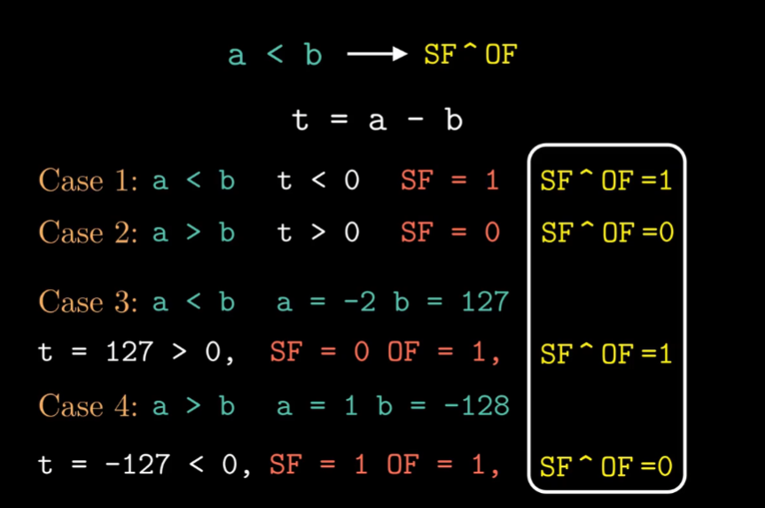

**set语句设置**

**输入一个set语句可以直接得到其不等式的True或者False。**

对于有符号数，如下图四个分别求其大于，大于等于，小于，小于等于的值。

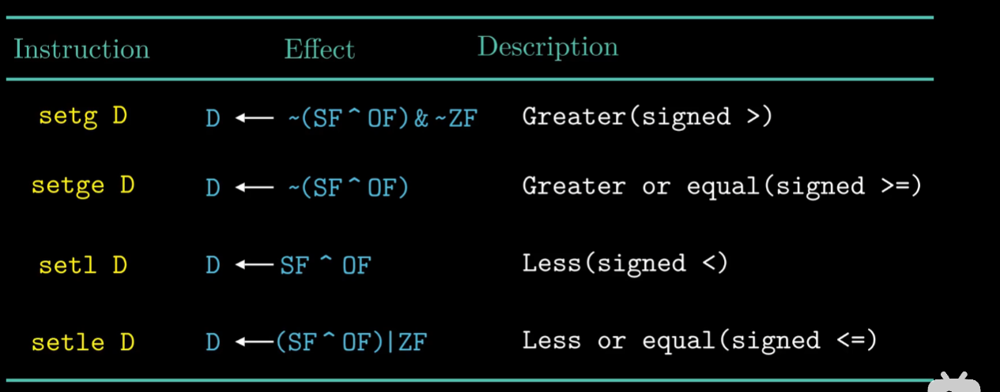

对于无符号数，其会变成无符号数与进位标志的组合。

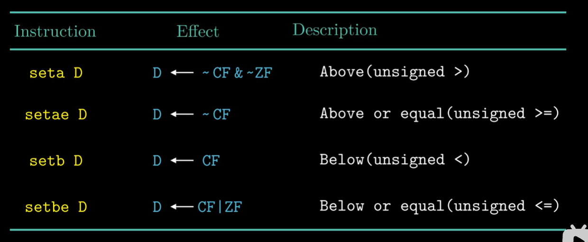

## 跳转指令与循环

if....else先判断第一个，不是就是第二个

**使用数据的条件转移代替控制的条件转移**

cmov根据条件码的某种组合进行有条件的传送。

## 过程

栈帧：实现过程/[函数调用](http://baike.baidu.com/view/2369016.htm)的一种[数据结构](http://baike.baidu.com/view/9900.htm)。

返回地址：主程序中CALL指令后面一条指令的地址

假如函数P有n个整型参数，当参数大于6时，参数7到n要用栈来传递。1到6通过寄存器传递。

栈默认分配8的倍数的储存空间。

## 数组的分配与访问

数组的地址是顺序地址

C语言中$*$一般是指取址操作

数组元素计算公式

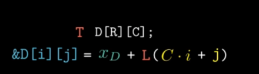

数组元素有这样的性质是因为其本身是顺序表，是连续数据结构。

## 结构体和联合体

struct结构体：地址要对齐。任何K字节的基本对象的地址必须为K的倍数。编译器会对结构体填充。

union联合体：大小取决于最大字段的大小。两个字段的使用是互斥的，则可以将两个组成一个联合体。

## 缓冲区溢出

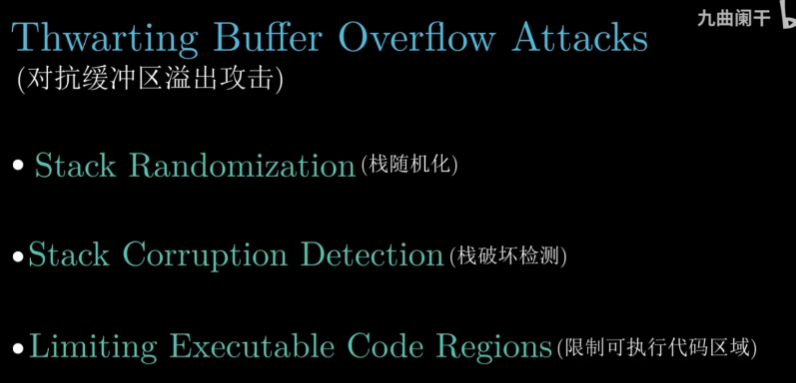

栈破坏检测：金丝雀值

限制可执行代码区域：让一些地方不可执行。

