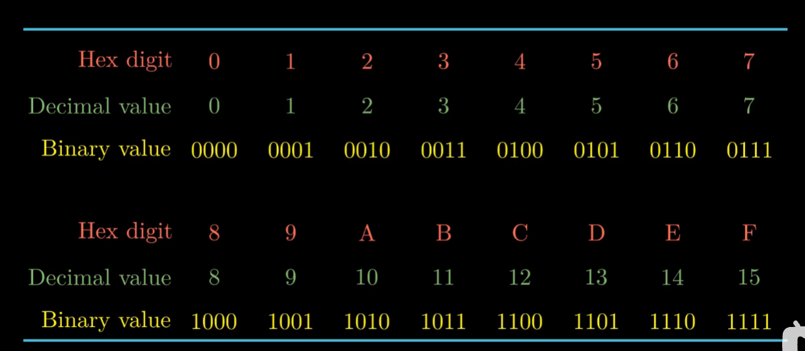

# 	第二章 信息的表达和处理

## 一.信息的存储

### 位模式

1.十进制

2.二进制

3.十六进制

**二进制，十进制，十六进制相对应**

十进制到十六进制和二进制可以使用辗转相除法。

二进制到十进制可以每位乘以相对应的$2^{n-1}$来进行求和操作。二进制到十六进制是以每四位二进制数为一个十六进制数，然后进行转化。

十六进制到十进制建议先转成二进制再到十进制。十六进制到二进制则为一个数代表二进制的四个数位。

### 大端法与小端法

大端法最高有效字节储存在最前面，小端法最高有效字节储存在最前面。

有些机器只支持单端，还有些机器支持双端法。

### 布尔运算

布尔运算是计算机逻辑代数的判断方法

逻辑运算所有非0的都为True，0为False。

### 位运算

有左移和右移。还分为逻辑右移和算术右移。

**对有符号数是算术右移，无符号数是逻辑右移。**

logical代表逻辑右移，arithmetic代表算术右移。

很明显在其右移的时候当x首位为0的时候两者没啥区别。当首位为1的时候逻辑右移补0，算术右移补1。

## 二.整数表示

### 数据类型

C语言中支持多种数据类型。如下图所示。

**在这种无符号数和有符号数区分是很重要的。**

### 无符号数

无符号数的表示其实很好理解，类似与正常二进制的转换。

这种只能表示非负数，有很大局限性。

### 补码（有符号数表示）

最高位取负值。当最高位为0的时候即为正值，最高位为1的时候即为负值。一般使用补码表示负值，**这也是有符号数的表示方法。**

### 整数类型的转换

**位模式不变，解释位的方式变了。**

对于相同的位模式,**有符号数到无符号数的表示**

**如图我们看到，当x小于0时，x需要加上$2^w$次方，当x大于等于0，就为x**

**无符号数到有符号数**

两者可以互相转化。本质上位模式没有变化，只是对首位的解释改变了。

在C语言中无符号数和有符号数一起进行处理，那有符号数则会强行转化为无符号数。

### 数据大小的转换

将整数转换为一个更大的数据类型

无符号数是进行0拓展，将增加的数位进行补0操作。

有符号数进行k位的符号位扩展，可以表示数值不变。**当符号位为0的时候就是补0，当符号位为1时补1.**

较大数据类型变为较小数据类型进行截断操作。

**截断过程：**

第一步将数用无符号数表示，然后进行阶段操作。

第二步就是将剩下的二进制进行转化，对其位模式进行解释。可以转化为无符号数和有符号数。

## 三.整数的运算

### 加法

#### 无符号数的加法

无符号数加法可能会发生溢出。当两者相加大于数位最大值，则其会发生溢出，此时得减去$2^w$。

#### 有符号数的加法

有符号数不仅会出现正溢出的情况，还会出现负溢出的情况。减去或者加上$2^{w-1}$，是因为在有符号数中，最高位为符号位。

### 减法

**在书中提出了加法逆元这个概念。**就比如说$y-x$,$x^,$为$x$的相反数，则$y-x$可以化为$y+x^,$。

#### 无符号数的减法

先求$x$的逆元。

然后再进行加法计算

#### 有符号数的减法

先求出$x$的逆元

有符号数最小值的逆元就是它本身。

通过求出其逆元再进行加法计算。

### 乘法

#### 无符号数的乘法

其值$z=x*y$的值为$(x*y)mod2^w$

运行结果等于x与y的乘积并对2的w次方进行取模运算。

#### 有符号数的乘法

有符号数的乘法和无符号数的乘法类似。本质上也是位模式没变，改变的是解释方法。

$x$与$y$的乘积为。

#### 乘法的其他事项

如图，虽然$x*y$可能不相同，但进行截断后的值位模式表示是相同。

我们也可以把乘法看作移位操作

如图我们将14转化为2进制,得到$(2^3+2^2+2^1)$，即可得到$x*14$可以转换为$(x<<3)+(x<<2)+(x<<1)$。

这种计算方式也方便。

### 除法

**整数的除法遇到除不尽的情况，会进行向0舍入。**

#### 无符号数的除法

除法的运算一般是进行右移操作。和乘法相同，但无符号数的除法是右移。

无符号数的除法进行的是逻辑右移。

#### 有符号数的除法

有符号数的除法是算术右移。

在这之中会要加上偏置这一概念。

x小于0则要加上偏置，x大于等于0就直接右移。

**除法并不能像乘法一样适用于所有数，一般只适用于$2^k$的除法。**

## 四.浮点数

整个浮点数进行储存中分为三个部分

$s$为符号位

$exp$为阶码字段。当阶码字段不全为0或者1，则其为规格化的值。当阶码字段全为0，则为非规格化的值。当阶码字段全为1，则为特殊值。

当阶码在1~254这个范围时，为规格化的值。

E还需要由e减去偏置量才能得出

当阶码全为0时，一是提供了0的表示方法，二是可以表示非常接近0的数。

当阶码全为1时，一是定义了无穷，二是定义$NaN$，即不是一个数的表示方法。

$frac$为尾数字段

#### **int12345转换**

1.先将其化为二进制

2.再用二进制科学表示法表示

3.取小数点后的数，得到浮点数尾数字段，单精度浮点数为23位，后面补0补到23位

4.通过阶数算出阶码

5.通过正负得出符号位

6.将以上的数组合形成float。

定义了四种舍入方法

