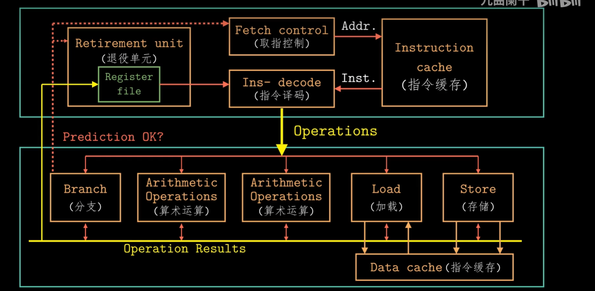
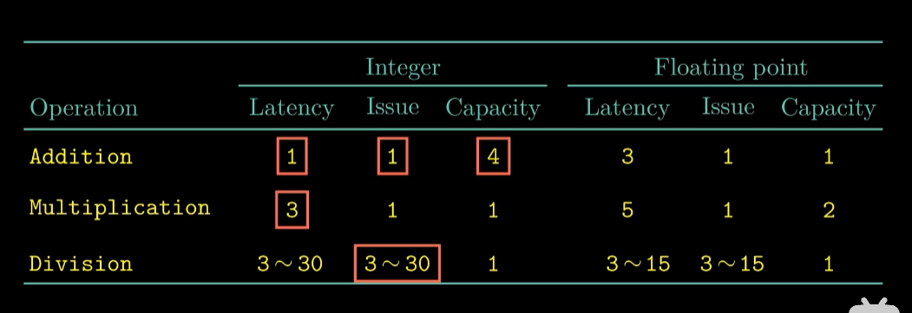
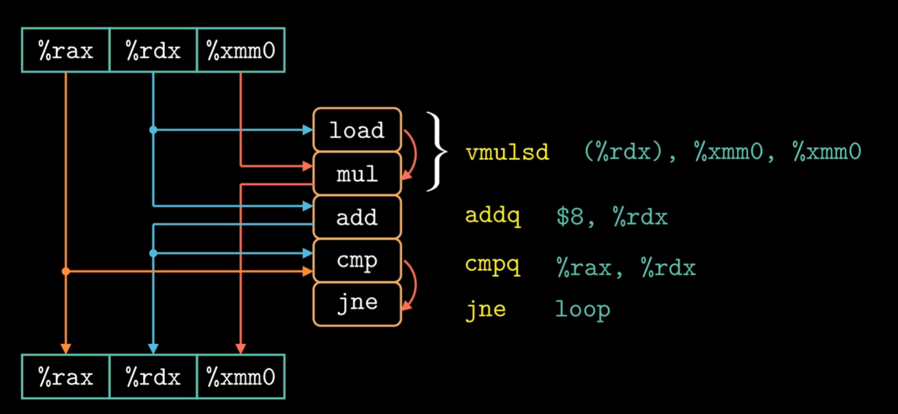
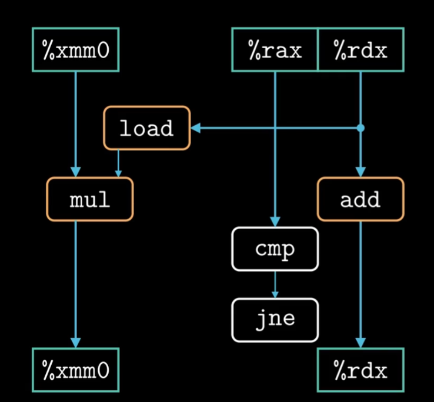
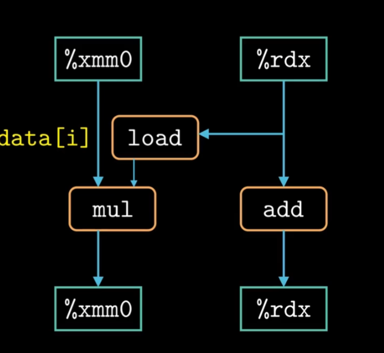
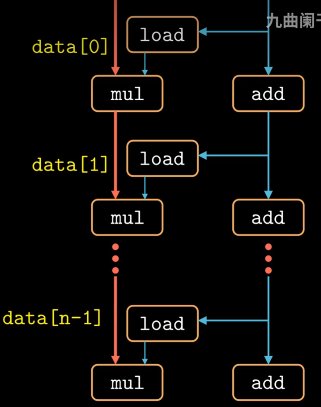
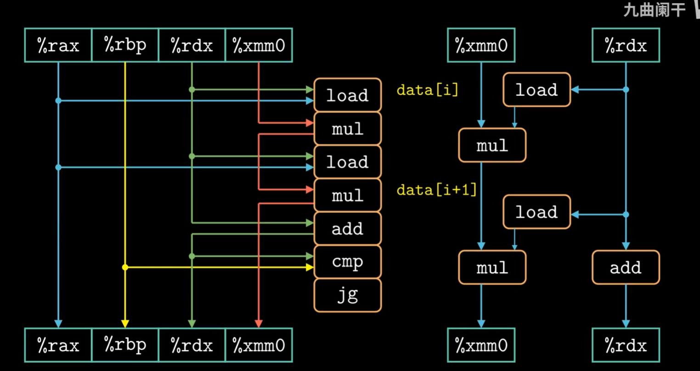
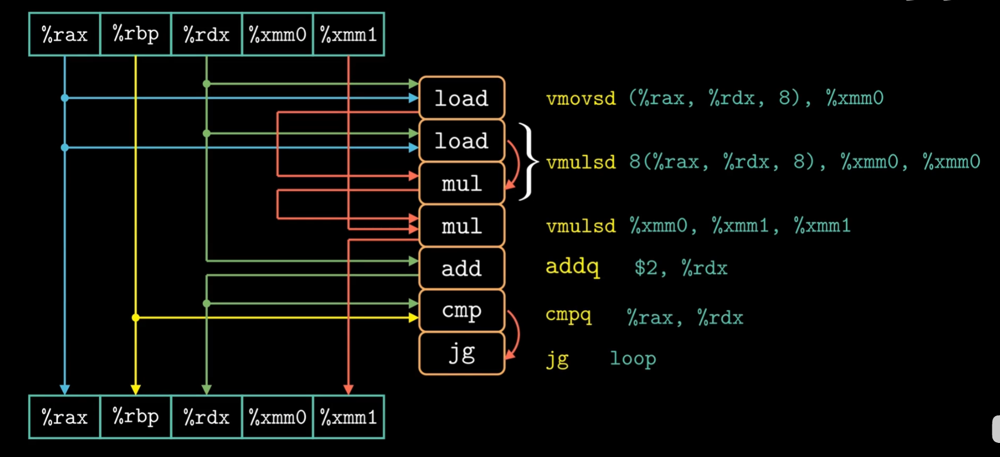
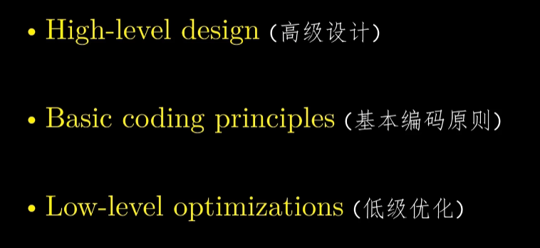

# 第五章 优化程序性能

## 优化程序性能

妨碍程序优化的因素：

1.存在内存别名引用的可能

2.函数调用

新的度量标准CPE：每个元素执行所需要的周期数

优化方法：

1.减少程序调用次数

2.消除内存引用

## 理解现代处理器

如果我们想进一步优化性能，我们必须进行微体系结构去优化。

现代处理器会进行分支预测

使用投机执行，其结果暂时不会进入寄存器和内存中，直到确定应该执行才写入寄存器中。

现代处理器每个周期都能执行不同的操作，而且是乱序执行的。

各个操作的时间列表，加法，乘法，除法的延迟，发射时间，和容量。其中发射时间表示两个连续的同类型运算之间所需的最小时钟周期数。

## 数据流图

我们可以将机器级代码化为数据流图。程序的数据流表示是非正式的，但我们可以用其更形象的描述程序中的数据相关是如何主宰程序性能的。

我们可以将现有的寄存器分为四种：**只读寄存器，只写寄存器，局部寄存器，循环寄存器**。

循环寄存器的操作链能很大程度上影响程序性能。

我们进一步改进数据流图，更为清晰。

再去掉不影响程序性能的比较操作和分支操作,剩下的只有循环寄存器和抽象操作。

接下来我们可以化为这样,左边红色为关键路径。mul的速度比add操作慢，就如我们在项目管理这种课所学的，带mul的操作是关键路径，远比提供数据的add操作慢。

## 循环展开

给予一些特殊方法可以减少关键路径的操作数量。

以下是循环展开带来的流程改变。load和mul指令可以和起来为vmulsd指令。

无论是否进行循环展开，关键路径还是关键路径。

combine_6的循环操作，在以上进行了改进

## 理解内存性能

如果我们的并行度p超过了可用的寄存器的数量，那么编译器会诉诸溢出，将某些临时值存在内存中，通常在运行时堆栈上分配空间。

循环展开的程度增加会因此没做到改善CPE，反而使其变差。

一个包含加载操作的程序的性能既依赖于流水线的能力，还依赖于加载单元的延迟。而在我们迄今为止所有的实例中，我们之分析了大部分内存引用都是加载操作的函数。也就是从内存位置读到寄存器中。

与之相对的是存储操作，其将一个寄存器的值写入内存。

其存储操作和加载操作可能会有相互关系，**这就叫写读相关**。其会影响很多性能。

## 总结

### 如何提高程序性能？

#### 	1.针对具体问题选择适当的算法和数据结构。

#### 	2.遵循一些基本的编码原则。

#### 	3.根据硬件的设计，通过循环展开等操作提高指令集并行。

