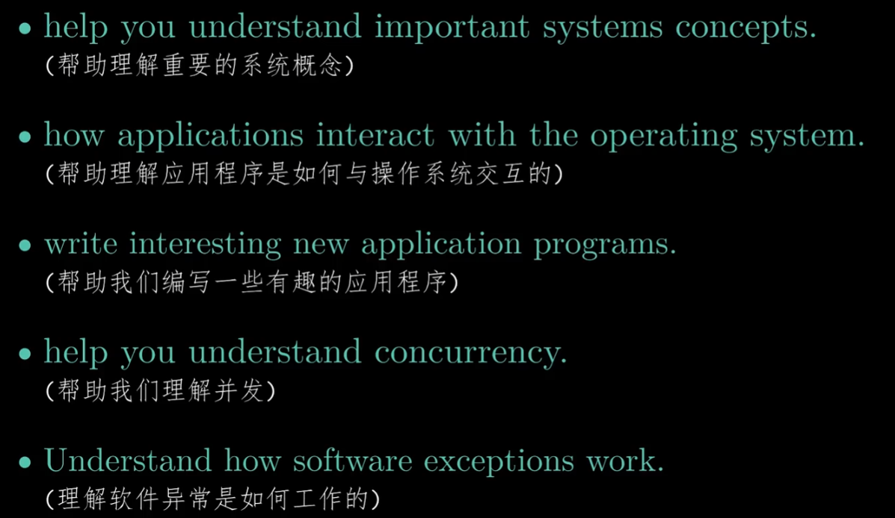
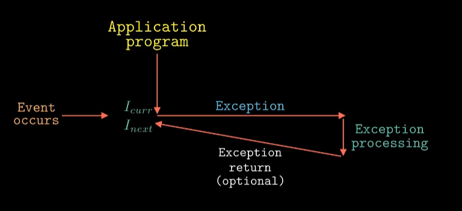
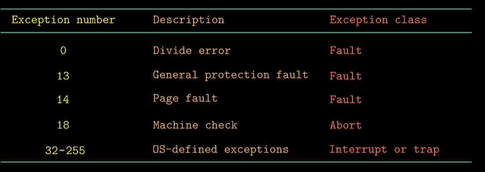
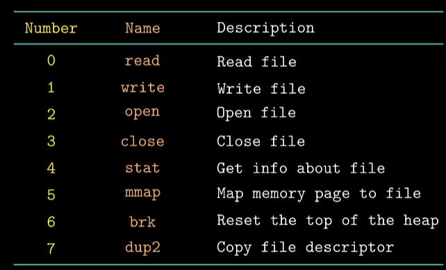
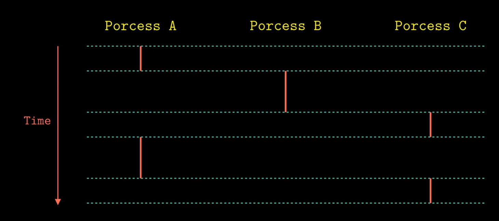
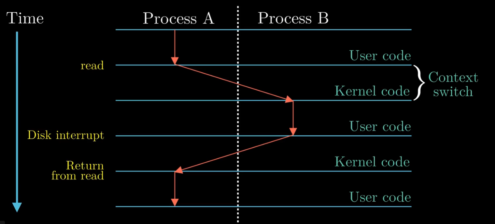

# 第八章 异常控制流

## 异常控制流

理解异常控制流的好处

异常就是控制流的突变

**exception**,这个常在写代码中常见的词语，就是异常

异常需要硬件和软件紧密配合。

异常需要硬件和软件一起配合。每个异常都有他单独的编号。

当处理器发生异常以及其编号，然后通过异常编号从异常表中检索对应的异常处理程序来处理这个异常。

异常表的起始地址是保存在CPU中一个特殊的寄存器中。通过异常表基址寄存器和异常号可以确定对应的异常表项。

**异常类似于过程调用，但也有不同之处**：

1.异常返回当前指令或者下一条指令

2.处理器会将一些额外的处理器状态压入栈中

3.控制从用户态转向内核态

4.运行在内核态

**一旦触发了异常，剩下的工作就是异常处理程序在软件中完成。**

## 异常

异常分为四类：中断（interrupt），陷阱（trap），故障（fault），终止（abort）。

| 类别 | 原因              | 异步/同步 | 返回行为                 |
| ---- | ----------------- | --------- | ------------------------ |
| 中断 | 来自I/O设备的信号 | 异步      | 总是能和返回到下一条指令 |
| 陷阱 | 有意的异常        | 同步      | 总是能和返回到下一条指令 |
| 故障 | 潜在可恢复的错误  | 同步      | 可能会返回到当前指令     |
| 终止 | 不可恢复的错误    | 同步      | 不会返回                 |

在X86有256中异常类型。0-31是Intel架构师定义的，剩下的是操作系统定义的。

操作系统异常事例

操作系统定义

## 进程与上下文

**进程就是一个执行中程序的实例**

逻辑控制流：如果你用调试器单步执行程序，会看到一系列的程序计数器（PC）的值，这些值唯一地对应于包含在程序的可执行目标文件的指令，或是包含在运行时动态链接到程序的共享对象中的指令。

一个逻辑流在执行时间上与另一个时间流chong'die的情况，称为并发流。

多个流并发的执行的一般现象成为并发。

**并发是交替运行的，并行是同时运行的。**

一个进程和其他进程轮流运行的概念称为多任务。

### 模式

处理器通常是用某个控制寄存器中的一个模式位来提供这种功能，该寄存器描述进程当前享有的特权吗。

当没有设置模式位时，进程就运行在用户模式。用户模式中的进程不运行执行特权指令，如停止处理器，改变模式位，或者发起一个I/O操作。也不允许用户模式的进程直接引用地址空间中内核区内的代码和数据。

运行应用程序的代码的进程初始时是在用户模式中的。进程从用户模式变为内核模式的唯一方法是通过诸如中断，故障或者陷入系统调用这样的异常。

### 上下文

内核为每个进程维持一个上下文。上下文就是内核重新启动一个被抢占的进程所需的状态。

在进程执行的某些关键时刻，内核可以决定抢占当前进程，并重新开始一个和先前被抢占的进程。这种决策叫 **调度**。由内核中的调度器处理。

在内核调度了一个新的进程运行后，他就抢占当前进程，并使用一种被称为 **上下文切换**的机制将控制转移到新的进程。

**上下文切换：**

（1）保存当前进程上下文

（2）恢复某个先前被抢占的进程和被保存的上下文。

（3）将控制传递给这个新恢复的进程。

## 进程的创建

进程有三个状态：运行，暂停，终止

父进程通过调用fork函数创建一个新的运行的子进程。

fork函数只调用一次，却返回两次。一次是在调用进程中，一次在新创建的子进程中。

父进程和子进程并发执行，代码相同但有单独的地址空间，执行时互不干扰，共享文件。

## 函数execve和函数waitpid

当一个和进程由于某种原因终止时，内核并不是立即将它从系统中删除。相反进程被保持在一种已终止的状态中，知道被它的父进程回收。

已终止但还未被会说的进程称为**僵死进程**（zombie）。

如果一个父进程终止了，内核会安排init进程成为它的孤儿进程的养父。init进程的PID为1，时在系统启动时由内核创建的，它不会终止，是所有进程的祖先。

### execve

**execve**函数在当前进程的上下文中加载并运行一个新的程序。

其加载并运行可执行目标文filename，且带参数列表argv和环境变量列表envp。只有当出现错误时，execve才会返回调用函数。 

我们可以利用fork和execve来运行程序，例如Unix shell和Web服务器这样的程序就大量使用了。

### waitpid

wait和waitpid函数是用来处理僵死进程的。

**waitpid()**会暂时停止目前进程的执行, 直到有信号来到或子进程结束。其回收指定进程号的子进程，可以设置是否阻塞。

如果在调用wait()时子进程已经结束, 则wait()会立即返回子进程结束状态值。 子进程的结束状态值会由参数status 返回, 而子进程的进程识别码也会一快返回. 如果不在意结束状态值, 则参数status 可以设成NULL. 参数pid 为欲等待的子进程识别码。wait()函数会进行阻塞。

## 信号

一个信号就是一条小消息，它通知进程系统发生一种类型的事件。

每种信号的类型都对应于某种系统事件。低层的硬件异常是由内核异常处理程序处理的，正常情况下对用户进程是不可见的。

传送一个信号到目的进程是由两个不同步骤组成的。

（1）发送程序。内核通过更新目的进程上下文中的某个状态，发送（递送）一个信号给目的进程。

（2）接收信号：当目的进程被内核强迫以某种方式对信号的发生做出反应时，它将接受了信号。

### 发送信号

Unix提供大量给进程发送信号的机制，其都是基于进程组这种概念的。

每个进程只属于一个进程组，进程组是由一个正整数进程组ID来标识的。

其可以使用 **/bin/kill**发送信号，用键盘发送信号，用kill函数和alarm函数发送信号。

### 接受信号

当内核把进程p从内核模式切换到用户模式时，它会检查进程p的未被阻塞的待处理信号的集合，那么内核将控制传递到p的逻辑控制流中的下一条指令。然而如果集合是非空的，那么内核选择的集合中的某个信号k并且强制p接受信号k。收到这个信号会触发进程采取某种行为。一旦进程完成了这个行为，那么控制就传递回p的逻辑控制流中的下一条指令。

每个信号类型都有一个预定义的默认行为：

（1）进程终止

（2）进程终止并转储内存

（3）进程停止（挂起）直到被SIGCONT信号重启。

（4）进程忽略该信号。

## 第八章后续内容待补充。
