# 第六章 储存器层次结构

## 存储技术

不同的存储速度和工艺决定了他们的价格。

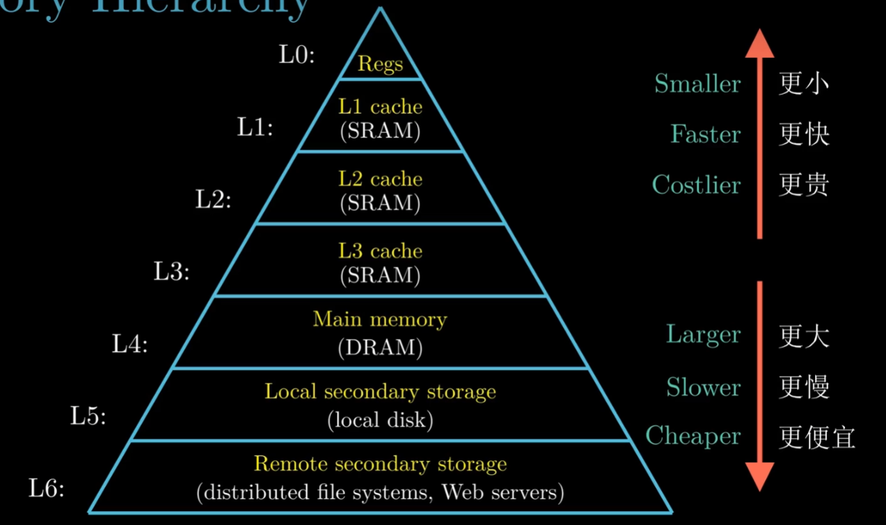

### SRAM

具有双存储的特性，**只要有电他就会永远地保持它的值**。如同一个倒转的钟摆只有两个稳定的配置或者状态。

即使有干扰当干扰消除时电路也会回复到稳定值。

### DRAM

对干扰更敏感，有电压干扰将无法恢复。

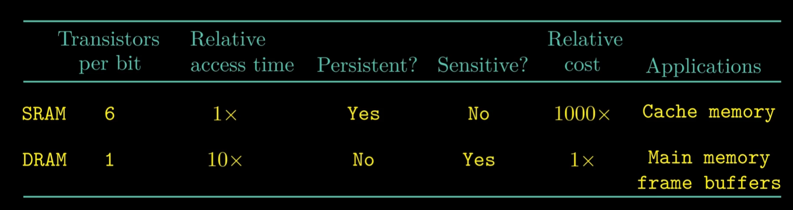

### 传统的DRAM

传统DRAM使用二维阵列的方式储存超单元。这种方式降低了引脚数，但会增加访问时间。

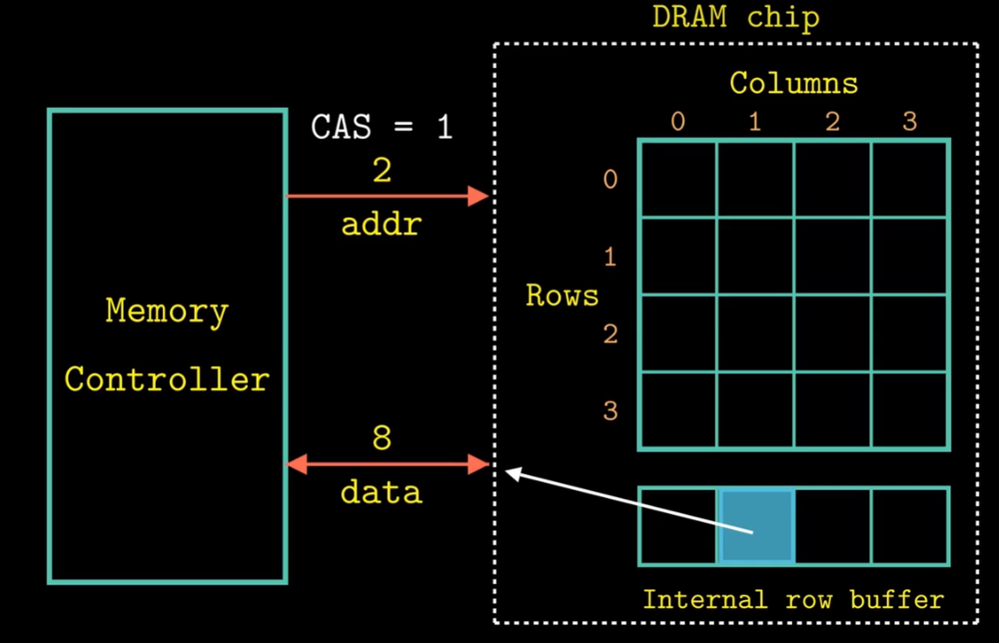

DRAM芯片被封装在内存模块，插在主办的扩展槽上。使用240个引脚的双列直插内存模块，以64位为块传送数据到内存控制器和从内存控制器传输数据。

每个DRAM发生八位数字。DRAM0是0-7位，依次类推，DRAM7为56到63位。

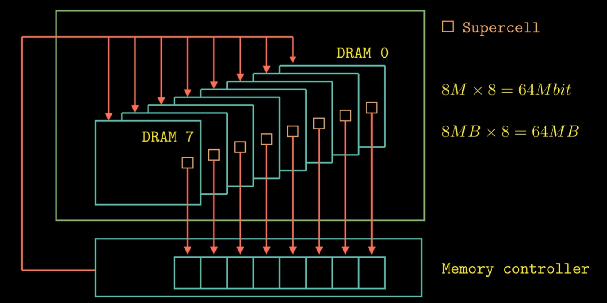

 我们常用的内存条 **DDR**，全称为DDR SDRM-Double Data-Rate Synchronous DRAM (双倍速率同步动态随机储存器)

## 磁盘存储

磁盘是由盘片构成。每个盘片有两面或者称为表面。每个表面是由一组成为磁道的同心圆组合，每个磁道被化为一组扇区。

读写头用于读取或者写入数据。所有读写头垂直排列，同步行动。

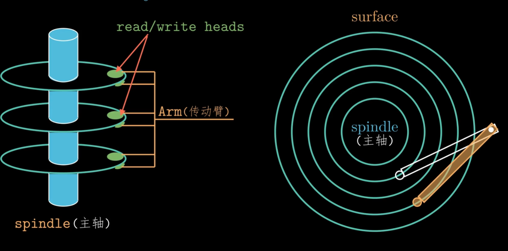

**对于磁盘和网络这种I/0设备，K=10^3, M=10^6**

磁盘访问数据所花费的时间。由下图可以看的出来主要是寻道时间和旋转时间。

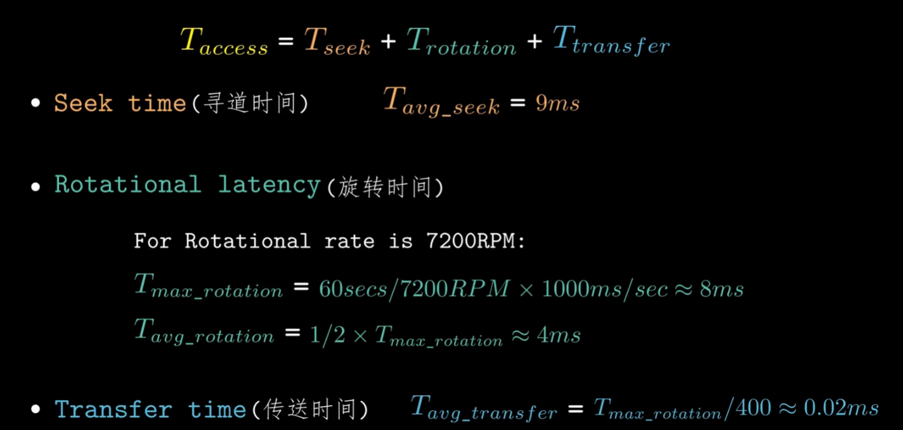

$$
磁盘容量=字节数/扇区*平均扇区数/磁道*磁道数/表面*表面数/盘片*盘片数/磁盘
$$

机械磁盘的原理

通过盘片，磁道，扇区三个抽象来储存数据。

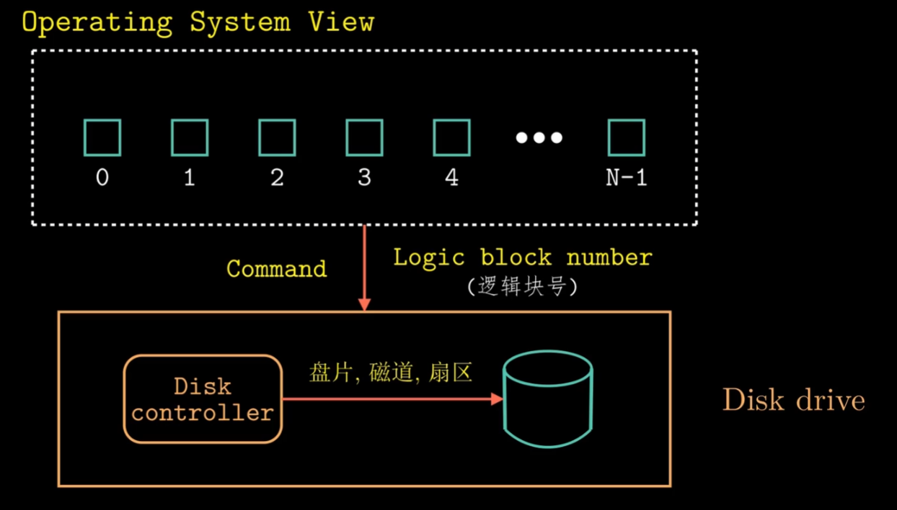

## 固态硬盘/局部性

### 固态硬盘

固态硬盘是基于闪存的存储技术。

擦除操作的本质是将所有的储存都变成1。

固态硬盘会使用平均磨损算法，将擦除平均到所有块中来最大化每个块的寿命。

优点：随机访问比机械硬盘更快，功耗更低，也更抗摔。缺点：价格更贵。

### 局部性

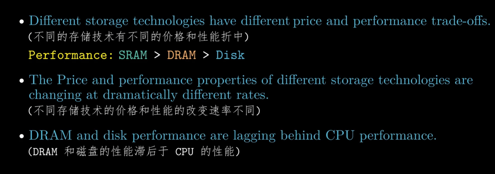

时间局部性：在良好的时间局部性程序中，被引用过一次的内存位置很可能在不远的将来被多次引用。

空间局部性：在良好的空间局部性程序中，如果一个内存位置被引用了一次，那么程序很可能在不远的将来引用附近一个内存位置。

## 存储器层次结构

**cache**，也就是高速缓存，一个小而快速的存储设备。

层次结构中离cpu越远的设备访问时间就越长。

缓存命中：当程序需要读取k+1层某个数据对象d，从第k层中开始检索，如果目标数据d刚好缓存在第k层中，这就叫缓存名字。缓存不命中即为没有缓存在第k层。

一个cache划为多个set，一个set化为多个cache line。

cache的结构如下。

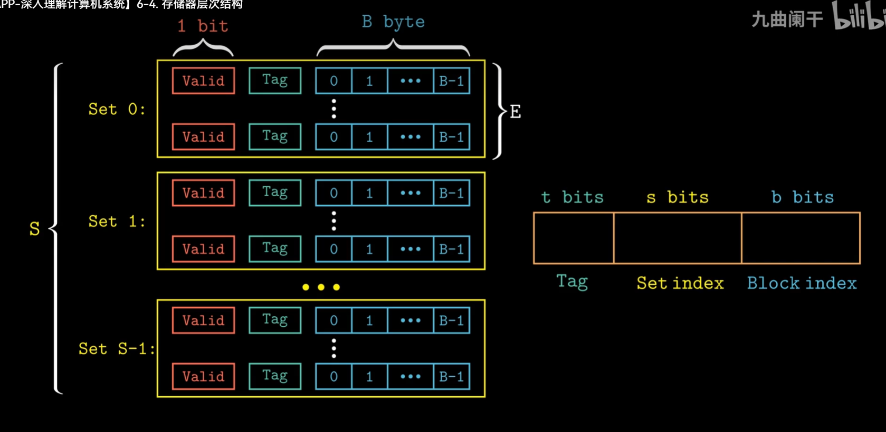

**(S,E,B,m)**

**S:组数 E:每个组的行数 B:块大小 m:物理地址位数**

## 直接映射高速缓存

当每个set只要一个cache line时，这叫直接映射。

先通过组索引位进行组选择，再进行行匹配。行匹配对比cache line的目标位是否一致，**其结果只有命中或者不命中**。一旦命中就进行字抽取。我们这样可以获得目标数据的抽取，再将数据传给CPU即可。以上是cache命中的情况。

由于不同的块映射到同一个set中，虽然整个cache还有空闲的空间， 但因为交替引用仍会出现冲突不命中的问题。

我们可以通过数据填充的方式来消除抖动，解决冲突不命中的问题。

## 组相联高速缓存

### 组相联cache

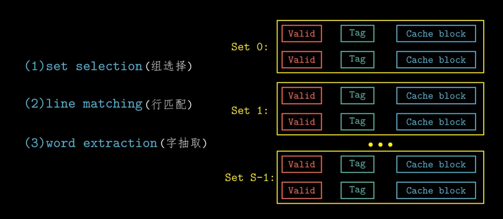

组选择也是通过组位索引来确定目标数据属于哪个set。

行匹配会遍历每一行来寻找有效位等于1并且与地址中的标志位相匹配的cache line。如果找到表示命中。再根据块偏移从这一行的数据块中抽取目标数据。字抽取和前面一样。

如果找不到符合的cache line则为不命中。cache从内存中取出包含目标数据的块。如果存在空行（Valid等于0）是一个不错的选择。

但如果没有空行可以使用以下策略：

1.随机替换

2.最不常使用(LFU)

3.最近最少使用(LRU)

### 全相联cache

**一个set包括所有的cache line**

全相联cache只适合做容量较小的高速缓存。

### 写入的策略

写入cache的简单介绍

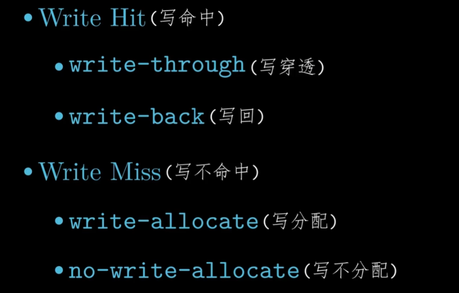

### cache的种类

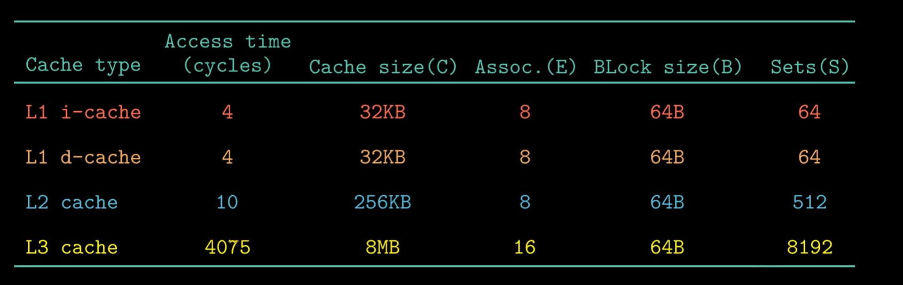

容量较大的cache能提高命中率，但其运行速度提升更难。

给定的cache的大小一定时，块越大cache的行数就越少。对空间局部性好的程序会好，对时间局部性好的程序就会受到损害。当发生不命中时，较大块的惩罚也会更大。